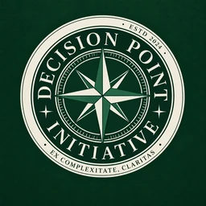

<p align="center">
  
</p>

# Decision Point Workshop

Decision Point Workshop is the public working layer of the [Decision Point Initiative](https://decisionpointinitiative.com/).

It starts from a simple premise:

> Most people use human attention, expertise, AI systems, software, data, and compute independently. What happens when we deliberately organize some of that intelligence around one shared problem?

This repository is intentionally public. It is not a general discussion forum; it is a place to produce inspectable work around consequential decision points.

## Current workshop

**DP-001 — Design the strongest possible National Competition for Governable AI Architectures**

Read [`workshops/DP-001-governable-ai-architectures.md`](workshops/DP-001-governable-ai-architectures.md), then choose a bounded work packet, join or form a team, submit an independent contribution, reproduce a result, or challenge an existing claim.

### Competition framework v0.1

An approved working baseline now turns the original competition proposition into a concrete structure for public refinement:

- [`Competition framework`](workshops/DP-001/COMPETITION.md) — participation model, seven-phase competition lifecycle, hard entry gates, and recognition.
- [`Evaluation framework`](workshops/DP-001/EVALUATION.md) — 100-point common framework plus multidimensional profiles, claim-specific tests, reproducibility, and adversarial evaluation.
- [`Governance`](workshops/DP-001/GOVERNANCE.md) — institutional representatives, balanced judging panels, recusals, pre-registration, and organizer firewall.
- [`Submission schema`](workshops/DP-001/SUBMISSION-SCHEMA.md) — claim sheets, evidence, provenance, resources, known limitations, and reproduction package.

The key participation shift is that a contributor does **not** need to invent an entire architecture or act as a principal investigator. A person can join an existing team, take a bounded work packet, design a test, reproduce a result, or try to falsify a claim.

Open starting points:

- [WP-001 — Define “governable” operationally](https://github.com/JosephJMWalker-MBA/Decision-Point-Workshop/issues/1)
- [WP-007 — Establish the simplest baselines](https://github.com/JosephJMWalker-MBA/Decision-Point-Workshop/issues/2)
- [WP-009 — Kill the competition](https://github.com/JosephJMWalker-MBA/Decision-Point-Workshop/issues/3)

## Workshop loop

```text
DECISION POINT
→ EVIDENCE
→ UNKNOWNS
→ WORK PACKETS
→ PARALLEL CONTRIBUTIONS
→ CHALLENGE
→ SYNTHESIS
→ DECISION / PROPOSAL
→ REALITY
→ REASSESS
```

## Intelligence pooling

Useful resources can include human attention, domain expertise, AI inference, software, public data, physical observation, criticism, verification, and compute. No participant needs all of these.

The first version deliberately tests coordination before building custom compute-pooling infrastructure.

## How to participate

- Read [`WORKSHOP.md`](WORKSHOP.md) for the operating model.
- Read [`CONTRIBUTING.md`](CONTRIBUTING.md) for contribution standards.
- Open a **Work Packet** issue to claim or propose a bounded task.
- Open a **Contribution** issue for a finding, analysis, artifact, prior-art result, or synthesis.
- Open a **Challenge / Falsification** issue to attack a claim, assumption, evaluation, architecture, or workshop premise.
- Open a pull request for durable artifacts and changes to workshop documents.

Serious disagreement is participation. A contribution that demonstrates that the workshop is based on a bad premise is successful work.

## Relationship to DPI

Decision Point Initiative is the institutional front door. This repository is the public workshop floor. The website can remain lightweight while collaboration happens here in the open.

**DPI:** https://decisionpointinitiative.com/

**Contact:** decisionpointinitiative@gmail.com
